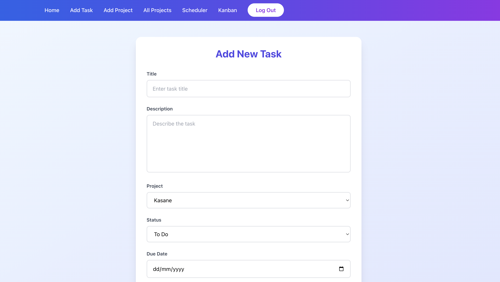
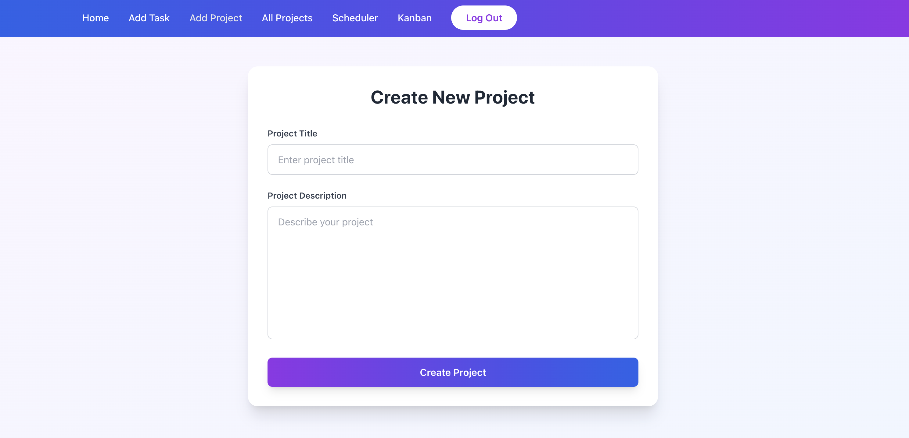
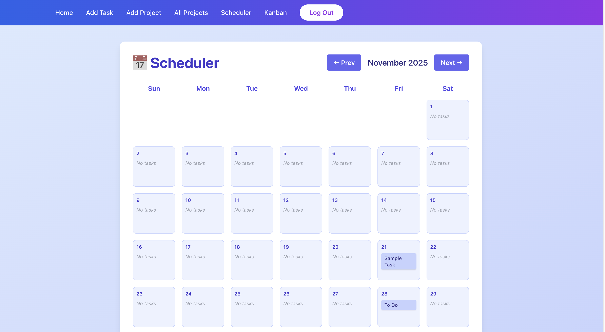

# Scrum Master Kanban Board using React and FAST API


## Tech Stack

The project back-end is created using Fast API in Python and React is used for the front-end. Tailwind CSS classes are used to style the UI components. It uses "react-form-hooks" for validating forms and Redux for state management. For the database "Postgres" has been used.

While most of my React projects use Vite, this one still uses create-react-app for bootstrapping React project. I might want to change that in future though.

## Introduction

It is a simple Kanban board application where you have four status 'To Do', 'In Progress', 'In Review' and 'Done'. You can create a generic task item and then through Kanban drag and drop dashboard, you can move items and save the updated status.

It has supoort for multi-user authentication.

It now supports project CRUD operations. A task can be a part of a project. A slide-show component using the library react-awesome-slider was also added recently.

## Updates

27/12/22 : Added Admin panel with support of being able to add users and tasks, modify any user or task for admin role user type.

1/5/23 : Scheduler was added which shows a custom calendar and all the tasks you have for a given date. Custom calendar is made using dayjs library in Javascript.

28/8/23 : Project module added with CRUD operations, a task might be associated with a given project. Error handling has been improved.

21/11/25 : Major UI upgrade

## Screenshots

The style might be a subject to change in the future for this project. But, as of now this is how few pages look like

Add Task form.



Kanban board displaying all the tasks which is the core feature of this application.


Form to add a new project



Calendar scheduler to get all the tasks 




A working demo of the application in form of video can be found here https://www.youtube.com/watch?v=oJZs_70UR2E

## Deployment using Docker containers

```sh
$ docker-compose up -d --build
$ docker-compose exec web alembic upgrade head
```
